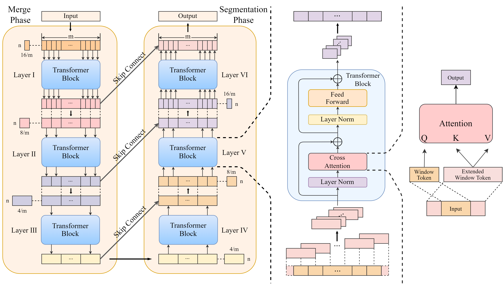

# STARFormer
This repo is the official implementation of Spatio-Temporal Aggregation Reorganization Transformer of FMRI for Brain Disorder Diagnosis.
[](https://pytorch.org/)
[](https://python.org/)
[](LICENSE)


# Modules
- ROI Spatial Structure Analysis Module: This module employs EC to reorganize brain regions based on their functional importance within seven established brain networks, ensuring the preservation and enhancement of crucial spatial relationships.

- Temporal Feature Reorganization Module: This module integrates multiscale local features with global representations through a unique variable window strategy, enabling the model to capture fine-grained temporal patterns at different scales while maintaining computational efficiency.

- The Spatio-Temporal Feature Fusion Module: This module comprises temporal and spatial branches that simultaneously extract multiscale temporal dependencies and spatial representations. The temporal branch incorporates the temporal feature reorganization module to learn local and global temporal features, while the spatial branch uses the reorganized ROI structure to capture disorder-specific patterns. 



# Requirements
```
numpy~=1.19.5
scikit-learn~=1.2.2
torch~=2.7.0
einops~=0.7.0
nilearn~=0.10.1
tqdm~=4.66.2
pandas~=1.3.5
```
Alternatively, you can choose to run the following code to install the required environment:
```
pip install -r requirements.txt
```

# Data
```
The data used in our work are from [ADHD-200][(https://adni.loni.usc.edu/)](https://fcon_1000.projects.nitrc.org/indi/adhd200/). and [ABIDE](http://preprocessed-connectomes-project.org/abide/). Please follow the relevant regulations to download from the websites.
```


# Training
python tester.py

# Citation
If you find this work useful, please cite:
```
@article{STARFormer2025,
  title={STARFormer: A Novel Spatio-Temporal Aggregation Reorganization Transformer of FMRI for Brain Disorder Diagnosis},
  author={Dong, Wenhao and Li, Yueyang and Zeng, Weiming and Chen, Lei and Yan, Hongjie and Siok, Wai Ting and Wang, Nizhuan},
  year={2025}
}
```


